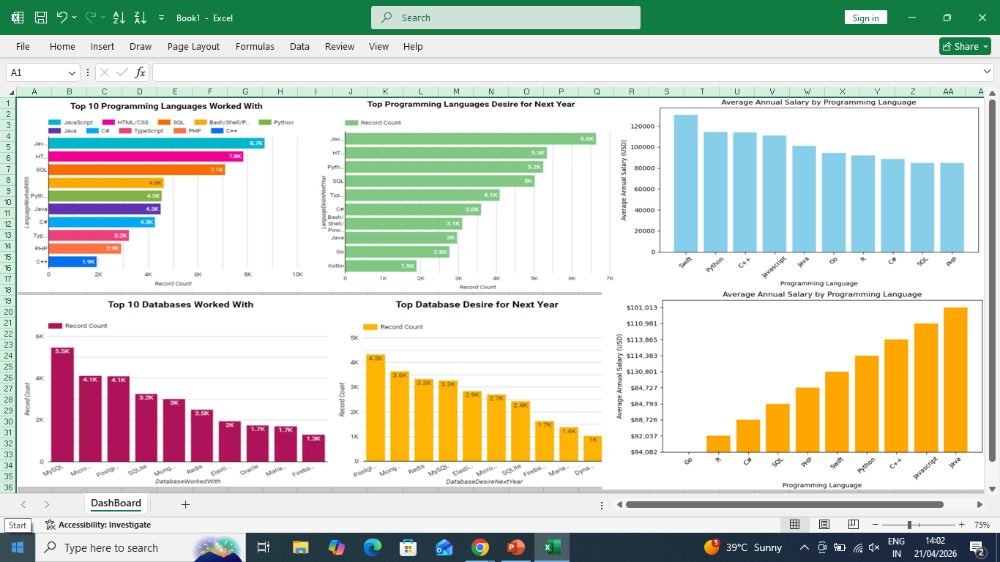
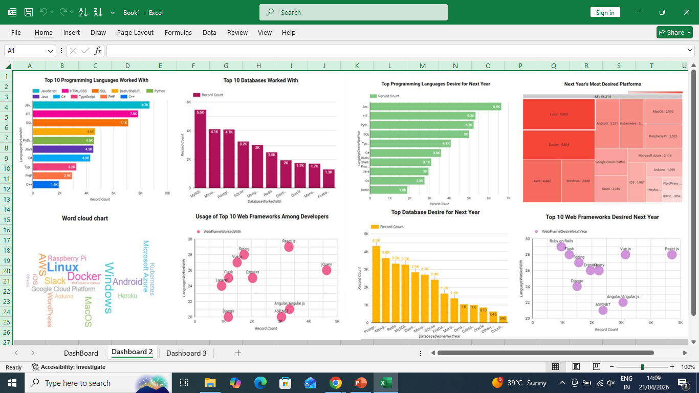
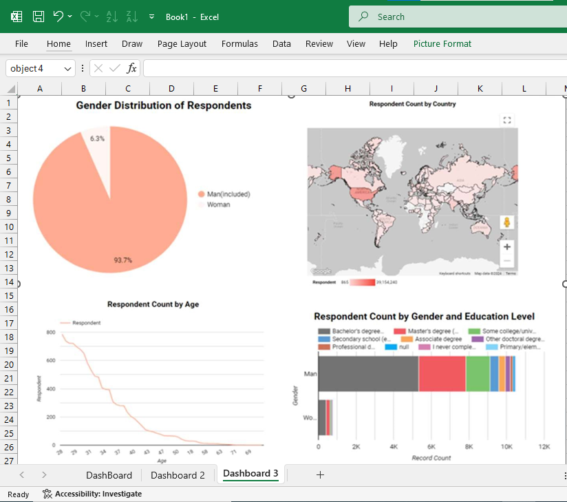

# 📊 IBM Data Analyst Capstone Project

## 🧾 Project Title
**An Analysis of Current Technology Adoption, Demographics, and Future Trends**

👩‍💻 **Created by:** Karishma Goyal  
📅 **Date:** April 2026  
🎓 **Course:** IBM Data Analyst Professional Certificate (Coursera)

---

## 📋 Project Overview
This capstone project analyzes real-world developer survey data to identify:
- Current technology usage (programming languages, databases, platforms, frameworks)
- Future technology trends and learning preferences
- Demographic insights (age, gender, country)

---

## 🎯 Key Insights
- **JavaScript** is the most used *and* most desired programming language  
- Strong demand for **web development skills** (HTML/CSS + SQL)  
- Shift from **Relational Databases → NoSQL** (MongoDB, Firebase, Redis)  
- **Python** is rising rapidly due to Data Science demand  
- Majority of respondents are aged **28–38 years**

---

## 🛠 Tools & Technologies
- **Power BI** – Interactive Dashboard Creation  
- **Excel** – Data Cleaning & Analysis  
- Data Visualization & Storytelling  

---

## 📊 Dashboard Preview

### 🔹 Tab 1: Current Technology Usage

### 🔹 Tab 2: Future Technology Trends

### 🔹 Tab 3: Demographics Analysis

---

## 📁 Project Files
📄 **Full Project Report:**  
👉 [Click here to view](Data Analyst Presentation.pdf)

📸 **Dashboard Screenshots:**  
Included in this repository

---

## 🙋‍♀️ My Contribution
- Cleaned and analyzed raw survey data  
- Built interactive dashboards in Power BI  
- Derived key insights and trends  
- Presented findings in a structured business format  

---

## 💡 Key Learnings
- End-to-end data analysis workflow  
- Dashboard building & visualization best practices  
- Translating data into actionable insights  
- Professional project presentation  

---

## 🚀 Career Focus
**Open to opportunities in:**  
👉 Data Analyst | HR Analyst | Power BI Analyst | Business Analyst  

---

⭐ *This project was completed as part of the IBM Data Analyst Professional Certificate on Coursera.*
